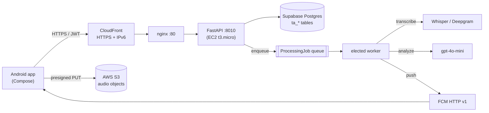

# Colloquia

An audio **recording → transcription → AI analysis** app (Otter.ai / Fireflies class). FastAPI backend
+ Kotlin/Jetpack-Compose Android client, reusing shared infrastructure (AWS S3, OpenAI, Deepgram,
Supabase Postgres, Google OAuth) with its own namespaced data.

> **Live:** backend deployed on AWS EC2 (`13.127.140.238`) behind **CloudFront over HTTPS+IPv6** at
> **https://d2nrls693zgomu.cloudfront.net/api/**. Infra is Terraform (`infra/terraform/`), auto-deployed
> by `.github/workflows/deploy-backend.yml`. The Android app targets the CloudFront URL by default.

- `backend/` — FastAPI + Prisma (Python). Idempotent presign→complete S3 uploads, a single-elected
  async queue worker with rate-limit cooldown, Whisper/Deepgram transcription, gpt-4o-mini analysis.
  Its tables share the Supabase DB but are namespaced `ta_*` and use `String` status columns (not Prisma
  enums) so they never collide with the co-resident field-repository app.
- `android/` — Kotlin + Compose client (`com.transcriptai.app`), ElevenLabs-inspired editorial theme.
- `infra/terraform/` — EC2 (t3.micro, free-tier) + CloudFront. See `infra/CLOUDFRONT.md`.
- `docs/ARCHITECTURE.md` — system, data-model, and flow diagrams (Mermaid).

## Architecture (at a glance)



## Features

**Capture** — Google + email/password sign-in; record with pause/resume/stop; background recording
(foreground service); live timer + level meter; offline outbox; presign→PUT→idempotent `/complete`
upload; library/history with search, sort, filter, favorites, archive, pin, folders & tags; rename/
delete; recently-viewed.

**Transcription** — async Whisper (timestamped segments, >24 MB chunked) **or Deepgram with true
speaker diarization** when a Deepgram key is set; inline segment editing; in-transcript search; manual
override; re-transcribe; export TXT / Markdown / DOCX / PDF; copy & share.

**AI** — titles; four summary types (brief/detailed/bullets/minutes); extraction of action items,
decisions, takeaways, deadlines, entities, keywords, topics; action-item completion; chat with the
transcript; translate / rewrite / tone / custom prompts.

**Phase 2** — integrations (Slack/Teams/Notion/Trello/Jira/webhook); Google Calendar/Tasks/Gmail;
collaboration (workspaces + sharing); meeting templates; automation rules; semantic & cross-transcript
search + knowledge graph; AI digest/coaching/conversation-analytics; voice-command intent; live
WebSocket transcription; **FCM HTTP v1 push** (service-account based — the legacy server key is
decommissioned). A **lite mode** (`LITE_MODE`, default on) keeps the free-tier box light by skipping
the compute-heavy paths (embedding indexing, live STT), falling back gracefully (e.g. keyword search).

See `DEFERRED.md` for what's wired vs. what needs your provider credentials.

## Run the backend locally

```powershell
cd backend
python -m venv .venv; .\.venv\Scripts\Activate.ps1
pip install -e .
$env:PATH = "$PWD\.venv\Scripts;$env:PATH"
python -m prisma generate --schema=prisma/schema.prisma
# Create the ta_* tables (additive; never touches other apps' tables):
python -m prisma db execute --schema=prisma/schema.prisma --file prisma/create_tables.sql
python -m prisma db execute --schema=prisma/schema.prisma --file prisma/phase2_tables.sql
python scripts/seed_admin.py
python -m uvicorn app.main:app --reload --port 8010
```

Health: `http://127.0.0.1:8010/health` · Docs: `http://127.0.0.1:8010/docs`.

## Run the Android app

```powershell
cd android
.\gradlew.bat :app:assembleDebug
adb install -r app/build/outputs/apk/debug/app-debug.apk
```

Defaults to the CloudFront URL. For the emulator, set `apiBaseUrl=http://10.0.2.2:8010/api/` in
`android/local.properties`.

## Deploy (GitHub Actions)

Push to `main` touching `backend/**` runs `deploy-backend.yml`. Required repo secrets: `EC2_HOST`,
`EC2_SSH_KEY` (the `infra/terraform/colloquia-deploy.pem` contents), `BACKEND_ENV` (prod `.env`),
`FCM_SERVICE_ACCOUNT_JSON` (Firebase service account for push). Terraform provisions the box + CloudFront.

## Outstanding setup (needs your console actions)

- **Google sign-in (Android):** register an **Android-type** OAuth client in the Google project with
  package `com.transcriptai.app` + the build's SHA-1. Credential Manager uses the web client id as
  serverClientId; the Android client must exist for it to return a credential.
- **FCM client:** drop `google-services.json` into `android/app/` and apply the
  `com.google.gms.google-services` plugin to start registering device tokens. Backend push is ready.
