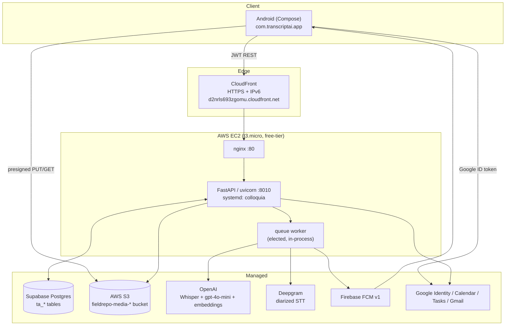
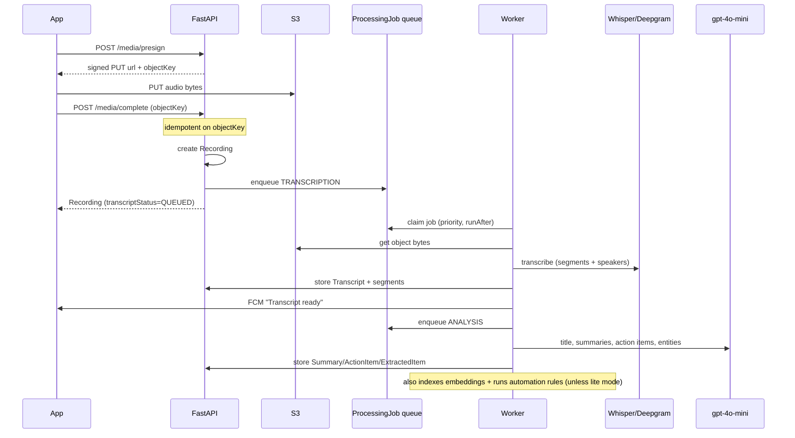
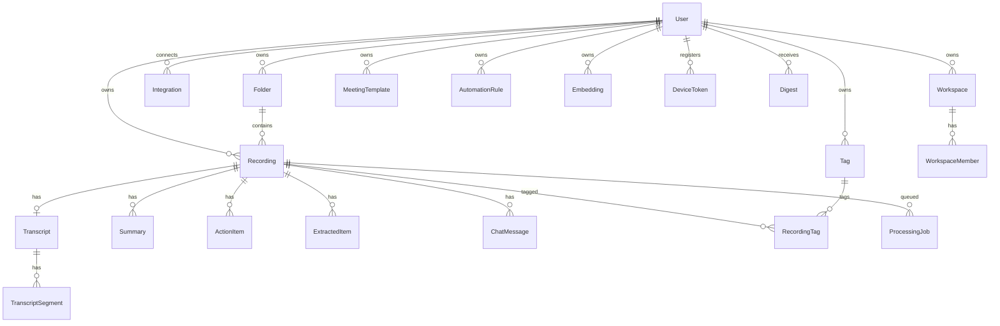
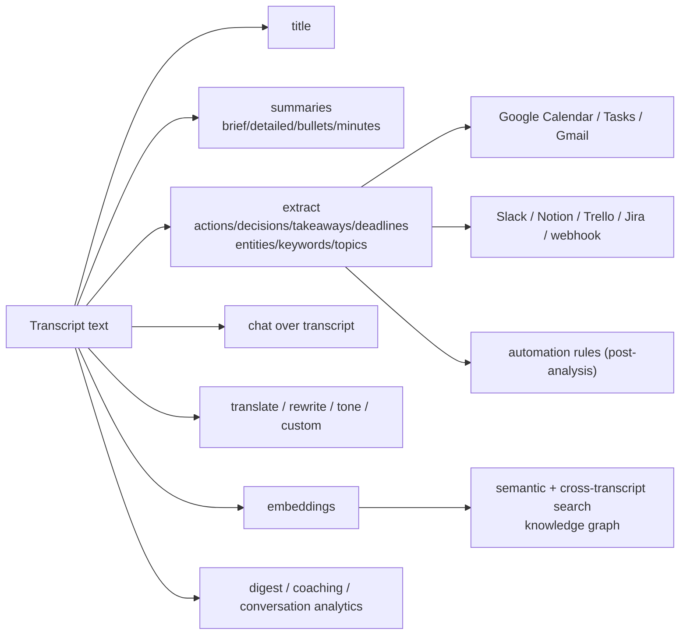
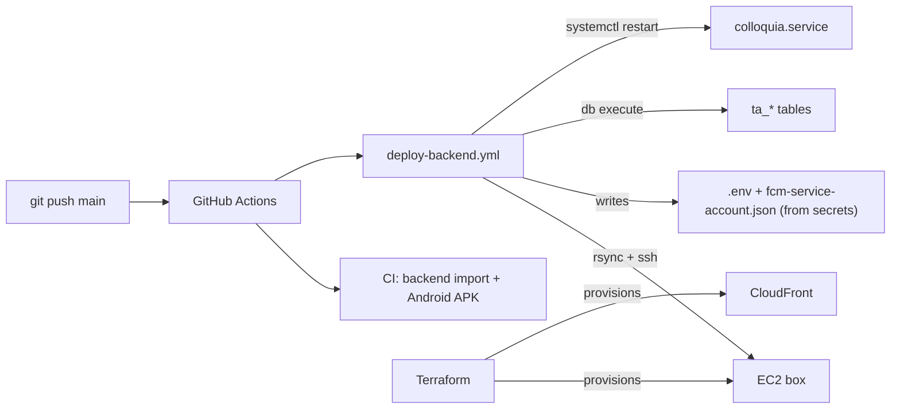

# Colloquia — Architecture

Colloquia is an API-first audio-intelligence app: an Android client and a FastAPI backend over JWT.
Heavy work (transcription, AI analysis) is decoupled from upload via a durable job queue drained by a
single elected worker, so a free-tier box stays responsive.

## 1. System context

## 2. Upload → transcription → analysis flow

### Resilience
- **Idempotent `/complete`** keyed on the unique `objectKey` → safe client retries (504-proof).
- **Rate limits (HTTP 429/503)** → global cooldown + requeue **without** consuming an attempt.
- **Off-peak / idle gating** for heavy work; **single elected worker** (advisory file lock) so only one
  process drains the queue.
- **Lite mode** skips embedding indexing + live STT on small hardware.

## 3. Data model (namespaced `ta_*`, shares the DB with the field-repo)

Status/role/kind columns are `String` (not Prisma enums) to avoid Postgres TYPE collisions with the
co-resident app. New tables are applied additively via `prisma/*.sql` (`db execute`), never `db push`
(which fails here with P1014) and never `migrate` (which would touch the shared `_prisma_migrations`).

## 4. AI capability map

## 5. Deployment

Secrets (GitHub Actions): `EC2_HOST`, `EC2_SSH_KEY`, `BACKEND_ENV`, `FCM_SERVICE_ACCOUNT_JSON`.
The EC2 box is stateless (DB on Supabase, media on S3) — it can be rebuilt from Terraform anytime.
